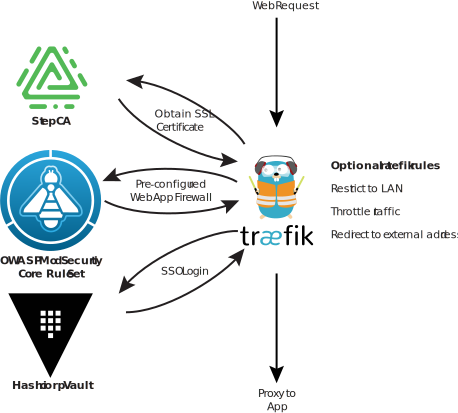

# Private Cloud Infrastructure

This repository hosts a set of docker compose files demonstrating how to a
configure a complete private cloud infrastructure, providing identity
management, MFA-capable authentication, automatic SSL certificate generation
and a Web App Firewall.

All of these services can be hosted on-premise, completely eliminating the need
for using public cloud hosted alternatives. Although using public cloud
services might be a lot easier to configure, this allows you to host everything
on-premise, in your private cloud, or just on your home PC or laptop. In fact,
you could probably run all of this on a Raspberry Pi(!), but the concepts from
this solution could be scaled to run across a datacentre.

## Overview

The high-level components are illustrated in the above figure. Each service
needs to be configured as per your own requirements. Further, split DNS should
be configured on your internal router for your domain, so that services don't
attempt to communicate with eachother through your router's WAN IP (which would
also require hairpin NAT to be configured on your router).

## Configuration

I would suggest setting up the services in the following order:-

1. Step Certificate Authority. See [certificates.md](docs/certificates.md)
2. `traefik` router. Read through the comments and configure 
   [`docker-compose-router.yaml`](docker-compose-router.yaml) and
   [`traefik.yaml`](traefik/traefik.yml) as per your requirements.
3. `Vault` Identity and OIDC Authentication provider. See
   [authentication.md](docs/authentication.md)
4. Add separate web services as necessary. An example `whoami` service is
   available in [`docker-compose-whoami.yaml`](docker-compose-whoami.yaml)

## Requirements

 - `docker`
 - [`docker-compose`](https://docs.docker.com/compose/)
 - Your own domain name. You can use any domain name, so long as you can edit
   the DNS settings on your router, local DNS server, and/or local hosts file.
 - A good text editor!
 - A bit of time to set up and configure everything.

## Credits

This project is really just a concept and a bunch of configuration files. None
of this would be possible without the backend software that this environment is
configured to run. The main components in use here include:-

  - [docker](https://www.docker.com/)
  - [traefik](https://traefik.io/)
  - [traefik-forward-auth by Thom Seddon](https://github.com/thomseddon/traefik-forward-auth)
  - [Step CA by smallstep](https://smallstep.com/docs/step-ca)
  - [Vault by Hashicorp](https://www.vaultproject.io/)
  - [Consul by Hashicorp](https://www.consul.io/)

Countless other backend technologies, standards, RFCs and communities have
contributed to make this stack possible.

## Disclaimer

Without applying a full software license on the documentation and resources
made avialable in this repository, which may or may not conflict with the
dependent software's licenses (I don't know), use this software architecture AT
YOUR OWN RISK. If using this implementation in your own systems, you agree to
clauses 15-17 of the [Gnu General Public License
v3](https://www.gnu.org/licenses/gpl-3.0.html), which state:-

> 15. Disclaimer of Warranty.
> THERE IS NO WARRANTY FOR THE PROGRAM, TO THE EXTENT PERMITTED BY APPLICABLE
> LAW. EXCEPT WHEN OTHERWISE STATED IN WRITING THE COPYRIGHT HOLDERS AND/OR OTHER
> PARTIES PROVIDE THE PROGRAM “AS IS” WITHOUT WARRANTY OF ANY KIND, EITHER
> EXPRESSED OR IMPLIED, INCLUDING, BUT NOT LIMITED TO, THE IMPLIED WARRANTIES OF
> MERCHANTABILITY AND FITNESS FOR A PARTICULAR PURPOSE. THE ENTIRE RISK AS TO THE
> QUALITY AND PERFORMANCE OF THE PROGRAM IS WITH YOU. SHOULD THE PROGRAM PROVE
> DEFECTIVE, YOU ASSUME THE COST OF ALL NECESSARY SERVICING, REPAIR OR
> CORRECTION.
> 
> 16. Limitation of Liability.
> IN NO EVENT UNLESS REQUIRED BY APPLICABLE LAW OR AGREED TO IN WRITING WILL ANY
> COPYRIGHT HOLDER, OR ANY OTHER PARTY WHO MODIFIES AND/OR CONVEYS THE PROGRAM AS
> PERMITTED ABOVE, BE LIABLE TO YOU FOR DAMAGES, INCLUDING ANY GENERAL, SPECIAL,
> INCIDENTAL OR CONSEQUENTIAL DAMAGES ARISING OUT OF THE USE OR INABILITY TO USE
> THE PROGRAM (INCLUDING BUT NOT LIMITED TO LOSS OF DATA OR DATA BEING RENDERED
> INACCURATE OR LOSSES SUSTAINED BY YOU OR THIRD PARTIES OR A FAILURE OF THE
> PROGRAM TO OPERATE WITH ANY OTHER PROGRAMS), EVEN IF SUCH HOLDER OR OTHER PARTY
> HAS BEEN ADVISED OF THE POSSIBILITY OF SUCH DAMAGES.
> 
> 17. Interpretation of Sections 15 and 16.
> If the disclaimer of warranty and limitation of liability provided above cannot
> be given local legal effect according to their terms, reviewing courts shall
> apply local law that most closely approximates an absolute waiver of all civil
> liability in connection with the Program, unless a warranty or assumption of
> liability accompanies a copy of the Program in return for a fee.
